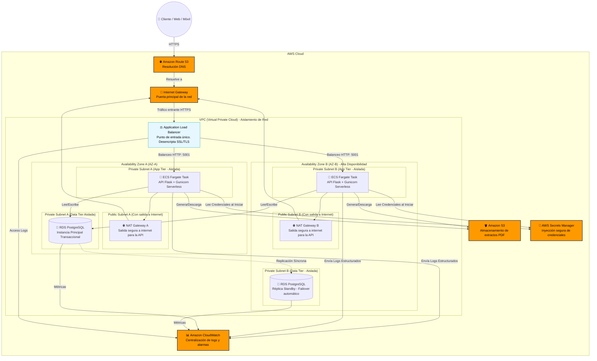

```mermaid
graph TB
    Client((👤 Cliente / Web / Móvil))

    subgraph "AWS Cloud"
        Route53[🌐 Amazon Route 53<br/>Resolución DNS]
        IGW[🚪 Internet Gateway<br/>Puerta principal de la red]

        S3[🪣 Amazon S3<br/>Almacenamiento de extractos PDF]
        CloudWatch[📊 Amazon CloudWatch<br/>Centralización de logs y alarmas]
        SecretsManager[🔐 AWS Secrets Manager<br/>Inyección segura de credenciales]

        subgraph "VPC (Virtual Private Cloud) - Aislamiento de Red"
            ALB[⚖️ Application Load Balancer<br/>Punto de entrada único. Desencripta SSL/TLS]

            subgraph "Availability Zone A (AZ-A)"
                subgraph "Public Subnet A (Con salida a Internet)"
                    NAT_A[🌐 NAT Gateway A<br/>Salida segura a internet para la API]
                end

                subgraph "Private Subnet A (App Tier - Aislada)"
                    Fargate_A[🐳 ECS Fargate Task<br/>API Flask + Gunicorn Serverless]
                end

                subgraph "Private Subnet A (Data Tier Aislada)"
                    RDS_Master[(🐘 RDS PostgreSQL<br/>Instancia Principal Transaccional)]
                end
            end

            subgraph "Availability Zone B (AZ-B) - Alta Disponibilidad"
                subgraph "Public Subnet B (Con salida a Internet)"
                    NAT_B[🌐 NAT Gateway B<br/>Salida segura a internet para la API]
                end

                subgraph "Private Subnet B (App Tier - Aislada)"
                    Fargate_B[🐳 ECS Fargate Task<br/>API Flask + Gunicorn Serverless]
                end

                subgraph "Private Subnet B (Data Tier - Aislada)"
                    RDS_Standby[(🐘 RDS PostgreSQL<br/>Réplica Standby - Failover automático)]
                end
            end
        end
    end

    %% Flujo de tráfico de usuarios
    Client -->|HTTPS| Route53
    Route53 -->|Resuelve a| IGW
    IGW -->|Tráfico entrante HTTPS| ALB
    ALB -->|Balanceo HTTP: 5001| Fargate_A & Fargate_B

    %% Conexiones internas (Backend a BD)
    Fargate_A & Fargate_B -->|Lee/Escribe| RDS_Master
    RDS_Master -.->|Replicación Síncrona| RDS_Standby

    %% Salida a internet para las tareas ECS (Si necesitan llamar APIs externas)
    Fargate_A --> NAT_A
    Fargate_B --> NAT_B
    NAT_A & NAT_B --> IGW

    %% Integraciones con servicios gestionados
    Fargate_A & Fargate_B -->|Genera/Descarga| S3
    Fargate_A & Fargate_B -->|Lee Credenciales al Iniciar| SecretsManager
    Fargate_A & Fargate_B -->|Envía Logs Estructurados| CloudWatch
    RDS_Master & RDS_Standby -->|Métricas| CloudWatch
    ALB -->|Access Logs| CloudWatch

    classDef aws fill:#FF9900,stroke:#232F3E,stroke-width:2px,color:black;
    classDef vpc fill:#F3F8FF,stroke:#3F8624,stroke-width:2px,stroke-dasharray: 5 5,color:black;
    classDef subnet_pub fill:#E6F7FF,stroke:#00A4A6,stroke-width:1px,color:black;
    classDef subnet_priv fill:#F0F8FF,stroke:#0055A4,stroke-width:1px,color:black;

    class S3,CloudWatch,SecretsManager,Route53,IGW aws;
    class ALB subnet_pub;
```
