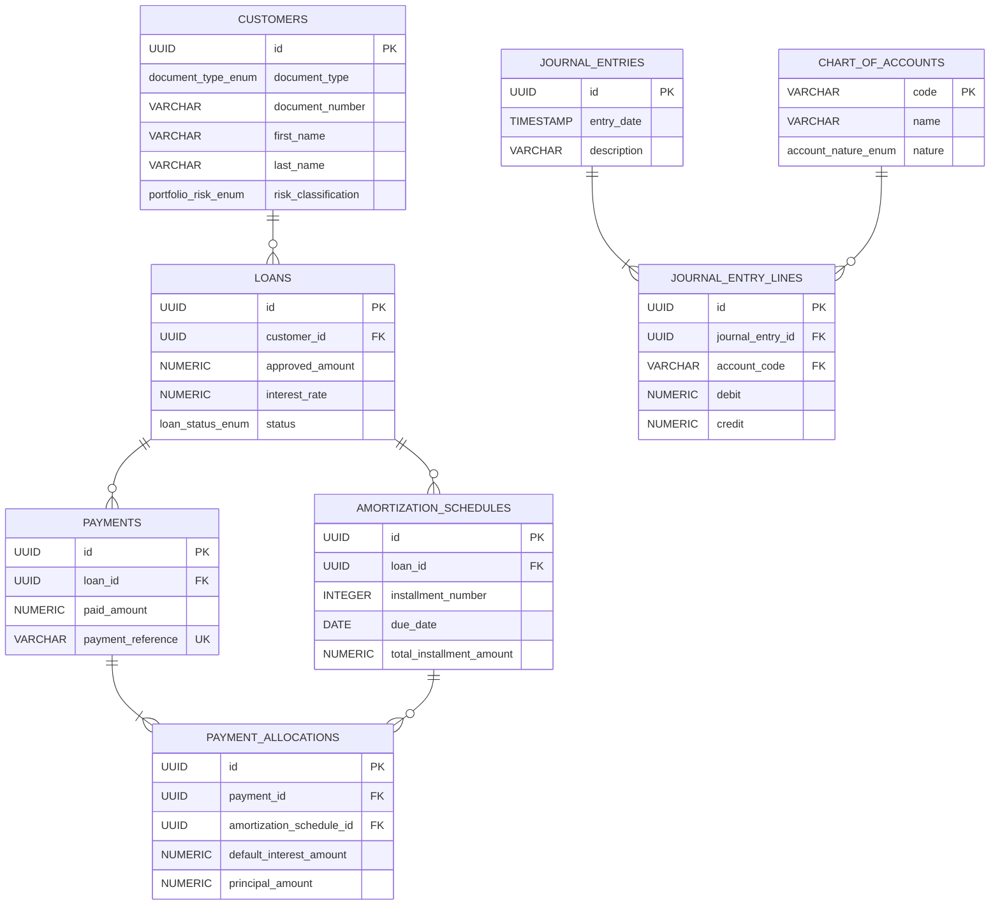

# Entity-Relationship Diagram (ERD)

Este archivo centraliza el modelo de la base de datos utilizando notación Mermaid.


```mermaid
erDiagram
CUSTOMERS {
UUID id PK
document_type_enum document_type
VARCHAR document_number
VARCHAR first_name
VARCHAR last_name
portfolio_risk_enum risk_classification
}
LOANS {
UUID id PK
UUID customer_id FK
NUMERIC approved_amount
NUMERIC interest_rate
loan_status_enum status
}
AMORTIZATION_SCHEDULES {
UUID id PK
UUID loan_id FK
INTEGER installment_number
DATE due_date
NUMERIC total_installment_amount
}
PAYMENTS {
UUID id PK
UUID loan_id FK
NUMERIC paid_amount
VARCHAR payment_reference UK
}
PAYMENT_ALLOCATIONS {
UUID id PK
UUID payment_id FK
UUID amortization_schedule_id FK
NUMERIC default_interest_amount
NUMERIC principal_amount
}
JOURNAL_ENTRIES {
UUID id PK
TIMESTAMP entry_date
VARCHAR description
}
JOURNAL_ENTRY_LINES {
UUID id PK
UUID journal_entry_id FK
VARCHAR account_code FK
NUMERIC debit
NUMERIC credit
}
CHART_OF_ACCOUNTS {
VARCHAR code PK
VARCHAR name
account_nature_enum nature
}

    CUSTOMERS ||--o{ LOANS : ""
    LOANS ||--o{ AMORTIZATION_SCHEDULES : ""
    LOANS ||--o{ PAYMENTS : ""
    PAYMENTS ||--|{ PAYMENT_ALLOCATIONS : ""
    AMORTIZATION_SCHEDULES ||--o{ PAYMENT_ALLOCATIONS : ""
    JOURNAL_ENTRIES ||--|{ JOURNAL_ENTRY_LINES : ""
    CHART_OF_ACCOUNTS ||--o{ JOURNAL_ENTRY_LINES : ""
```

```

```
